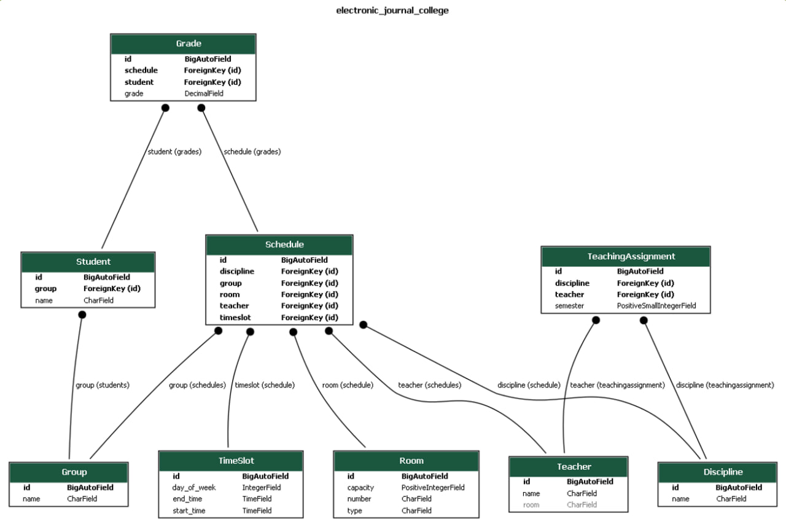
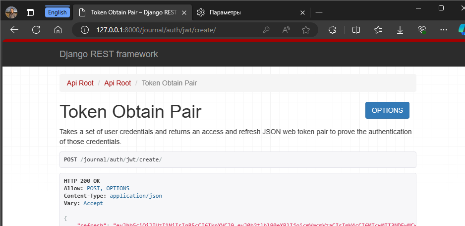

# Отчёт по лабораторной работе

**Цель:** овладеть практическими навыками реализации серверной части (backend) приложений средствами Django REST
framework.

**Оборудование:** компьютерный класс.

## Практическое задание

Вариант:
Создать программную систему, предназначенную для учебной части колледжа. Она должна обеспечивать хранение сведений о
каждом преподавателе, о дисциплинах, которые он преподает, номере закрепленного за ним кабинета, о расписании занятий.
Существуют преподаватели, которые не имеют собственного кабинета. О студентах должны храниться следующие сведения:
фамилия и имя, в какой группе учится, какую оценку имеет в текущем семестре по каждой дисциплине. Замдекана должен иметь
возможность добавить сведения о новом преподавателе или студенте, внести в базу данных семестровые оценки студентов
каждой группы по каждой дисциплине, удалить данные об уволившемся преподавателе и отчисленном из колледжа студенте,
внести изменения в данные об преподавателях и студентах, в том числе поменять оценку студента по той или иной
дисциплине.

ERD:



## Файл models.py

## Модель Room

Модель `Room` представляет комнату в школе или учебном заведении. Она имеет следующие поля:

- `number`: CharField с максимальной длиной 10 символов. Хранит номер комнаты и является уникальным.
- `capacity`: PositiveIntegerField. Хранит вместимость комнаты.
- `type`: CharField с максимальной длиной 50 символов. Хранит тип комнаты.

## Модель Teacher

Модель `Teacher` представляет учителя или преподавателя. Она имеет следующие поля:

- `name`: CharField с максимальной длиной 100 символов. Хранит имя учителя.
- `room`: CharField с максимальной длиной 100 символов. Хранит номер комнаты, где находится учитель. Может быть пустым
  или null.
- `disciplines`: ManyToManyField к модели `Discipline` через модель `TeachingAssignment`. Представляет дисциплины,
  преподаваемые учителем.

## Модель Discipline

Модель `Discipline` представляет предмет или дисциплину. Она имеет следующие поля:

- `name`: CharField с максимальной длиной 100 символов. Хранит название дисциплины.

## Модель Group

Модель `Group` представляет группу студентов. Она имеет следующие поля:

- `name`: CharField с максимальной длиной 100 символов. Хранит название группы.

## Модель TeachingAssignment

Модель `TeachingAssignment` представляет назначение учителя на дисциплину в определенный семестр. Она имеет следующие
поля:

- `teacher`: ForeignKey к модели `Teacher`. Представляет учителя, назначенного на дисциплину.
- `discipline`: ForeignKey к модели `Discipline`. Представляет дисциплину, назначенную учителю.
- `semester`: PositiveSmallIntegerField. Хранит номер семестра и проходит валидацию на значение от 1 до 99.
- `unique_together`: Мета-опция для обеспечения уникальности комбинации учителя, дисциплины и семестра.

## Модель Student

Модель `Student` представляет студента. Она имеет следующие поля:

- `name`: CharField с максимальной длиной 100 символов. Хранит имя студента.
- `group`: ForeignKey к модели `Group` со связаным именем 'students'. Представляет группу, к которой принадлежит
  студент.

## Модель TimeSlot

Модель `TimeSlot` представляет временной слот для занятия или активности. Она имеет следующие поля:

- `day_of_week`: IntegerField с выбором дней недели (понедельник - воскресенье).
- `start_time`: TimeField. Хранит время начала временного слота.
- `end_time`: TimeField. Хранит время окончания временного слота.
- `str()`: Метод, который возвращает отформатированную строковую представление временного слота.

## Модель Schedule

Модель `Schedule` представляет запись в расписании для группы, временного слота, комнаты, дисциплины и учителя. Она
имеет следующие поля:

- `group`: ForeignKey к модели `Group` со связаным именем 'schedules'. Представляет группу, для которой создается запись
  в расписании.
- `timeslot`: ForeignKey к модели `TimeSlot`. Представляет временной слот для записи в расписании.
- `room`: ForeignKey к модели `Room`. Представляет комнату для записи в расписании.
- `discipline`: ForeignKey к модели `Discipline`. Представляет дисциплину для записи в расписании.
- `teacher`: ForeignKey к модели `Teacher` со связаным именем 'schedules'. Представляет учителя для записи в расписании.
- `str()`: Метод, который возвращает отформатированную строковую представление записи в расписании.

## Модель Grade

Модель `Grade` представляет оценку, полученную студентом за определенную запись в расписании. Она имеет следующие поля:

- `schedule`: ForeignKey к модели `Schedule` со связаным именем 'grades'. Представляет запись в расписании, за которую
  выставлена оценка.
- `student`: ForeignKey к модели `Student` со связанным именем 'grades'. Представляет студента, который получил оценку.
- `grade`: DecimalField с максимальным количеством цифр 3 и 1 десятичным знаком. Хранит оценку, выставленную студенту, и
  проходит валидацию на значение от 1.0 до 5.0.
- `unique_together`: Мета-опция для обеспечения уникальности комбинации записи в расписании и студента.
- `str()`: Метод, который возвращает отформатированную строковую представление оценки.

В Django для работы с сериализаторами используются файлы serializers.py.

## Файл serializers.py

### RoomSerializer

Сериализатор RoomSerializer используется для преобразования модели Room в JSON-представление и наоборот. Он определяет
модель, с которой будет работать (Room) и указывает, что все поля модели должны быть включены в сериализацию.

Аналогично для других моделей.

## Файл views.py

### Описание класса RoomViewSet

Класс RoomViewSet является представлением (view) для модели Room. Он наследуется от viewsets.ModelViewSet из пакета
rest_framework.

RoomViewSet предоставляет следующие функциональности:

- queryset: Атрибут, который определяет набор данных, из которого будут извлекаться объекты модели Room. В данном
  случае, queryset установлен на Room.objects.all(), что означает, что будут извлекаться все объекты модели Room.
- serializer_class: Атрибут, который определяет сериализатор, используемый для преобразования объектов модели Room в
  JSON-представление и наоборот. В данном случае, serializer_class установлен на RoomSerializer, что означает, что будет
  использоваться сериализатор RoomSerializer для работы с объектами модели Room.

RoomViewSet наследует все функциональности, предоставляемые viewsets.ModelViewSet, включая методы для создания, чтения,
обновления и удаления объектов модели Room. Кроме того, он автоматически генерирует соответствующие конечные точки API
для работы с данными модели Room.

Таким образом, класс RoomViewSet предоставляет API-интерфейс для работы с объектами модели Room, включая возможность
создания, чтения, обновления и удаления записей. Он использует сериализатор RoomSerializer для преобразования данных в
формат JSON и обратно.

Аналогично для других моделей.

## Регистрация / авторизация по токенам / вывод информации о текущем пользователе средствами Djoser.

Djoser — это библиотека для Django REST Framework, которая обеспечивает готовые к использованию эндпоинты для обработки таких вещей, как регистрация, управление пользователями, а также аутентификация через токены.

1. pip install djoser
   pip install djangorestframework-simplejwt
   

2. 
```
INSTALLED_APPS = [
       # ...
       'rest_framework',
       'rest_framework.authtoken',
       'djoser',
       # ...
   ]
```

3. Для JWT-токенов нужно добавить дополнительную настройку для REST Framework в settings.py:

```
      from datetime import timedelta

   REST_FRAMEWORK = {
       'DEFAULT_AUTHENTICATION_CLASSES': (
           'rest_framework_simplejwt.authentication.JWTAuthentication',
       ),
       # ...
   }

   SIMPLE_JWT = {
       'ACCESS_TOKEN_LIFETIME': timedelta(minutes=30),
       'REFRESH_TOKEN_LIFETIME': timedelta(days=1),
       'ROTATE_REFRESH_TOKENS': False,
       'BLACKLIST_AFTER_ROTATION': True,

       'ALGORITHM': 'HS256',
       'SIGNING_KEY': SECRET_KEY,
       'VERIFYING_KEY': None,
       'AUTH_HEADER_TYPES': ('Bearer',),
       'USER_ID_FIELD': 'id',
       'USER_ID_CLAIM': 'user_id',
       'AUTH_TOKEN_CLASSES': ('rest_framework_simplejwt.tokens.AccessToken',),
   }
```

4.URL-адреса Djoser в urls.py:
```
urlpatterns = [
    ...
    path('auth/', include('djoser.urls')),
    path('auth/', include('djoser.urls.authtoken')),  # Для использования авторизации по токенам
    path('auth/', include('djoser.urls.jwt')),  # Для использования JWT
```

5. python manage.py makemigrations
   python manage.py migrate
   

Теперь Djoser обрабатывает запросы для регистрации (/auth/users/), входа в систему (/auth/token/login/ для авторизации по токенам, /auth/jwt/create/ для JWT-токенов), выхода из системы (/auth/token/logout/), а также другие связанные с управлением пользователями операции.

О текущем пользователе можно получить информацию через эндпоинт: /auth/users/me/




## Документация swagger:

Доступна на локальном хосте: http://localhost:8000/journal/swagger/


