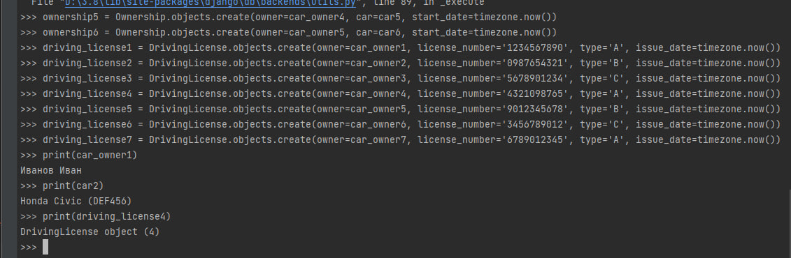
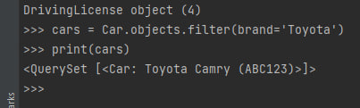
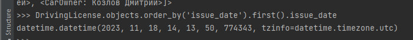
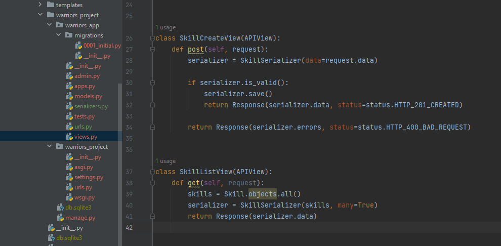
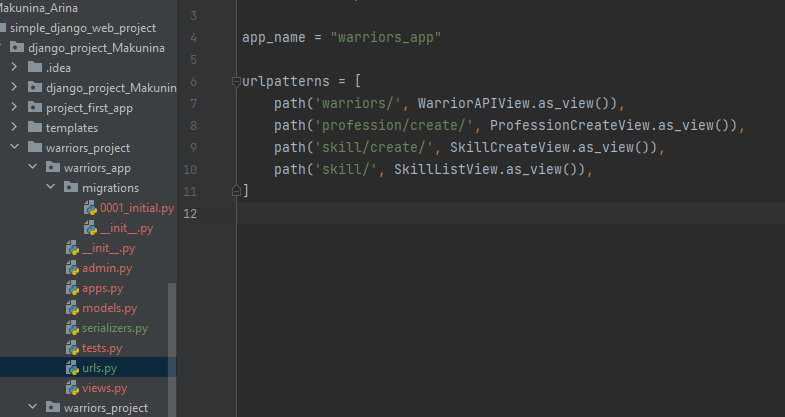
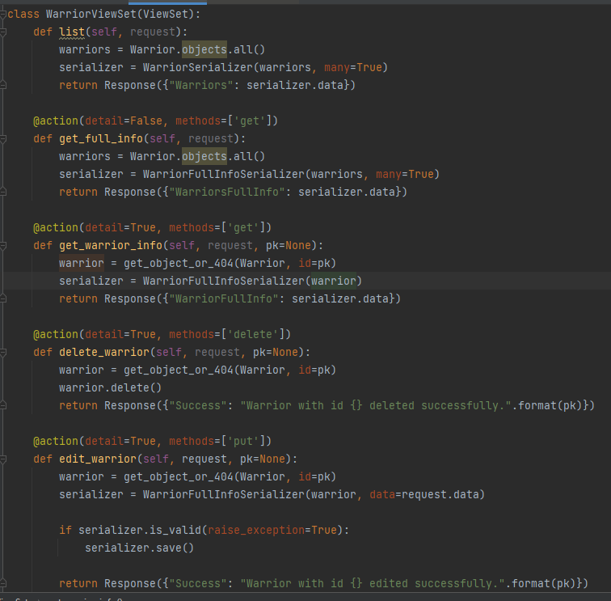

# Отчёт по практической работе

## Практическое задание 1

Воспользуйтесь проектом из практики 2.1 и напишите запрос на создание 6-7 новых автовладельцев и 5-6 автомобилей. Для каждого автовладельца назначьте удостоверение и от 1 до 3 автомобилей.

Пример кода для выполнения задания:

```python
from django.utils import timezone
from project_first_app.models import *

# Создание новых автовладельцев
car_owner1 = CarOwner.objects.create(last_name='Иванов', first_name='Иван', birth_date=timezone.now())
car_owner2 = CarOwner.objects.create(last_name='Петров', first_name='Петр', birth_date=timezone.now())
car_owner3 = CarOwner.objects.create(last_name='Сидоров', first_name='Сидор', birth_date=timezone.now())
car_owner4 = CarOwner.objects.create(last_name='Смирнов', first_name='Алексей', birth_date=timezone.now())
car_owner5 = CarOwner.objects.create(last_name='Козлов', first_name='Дмитрий', birth_date=timezone.now())
car_owner6 = CarOwner.objects.create(last_name='Васильев', first_name='Михаил', birth_date=timezone.now())
car_owner7 = CarOwner.objects.create(last_name='Новиков', first_name='Андрей', birth_date=timezone.now())

# Создание новых автомобилей
car1 = Car.objects.create(registration_number='ABC123', brand='Toyota', model='Camry', color='Red')
car2 = Car.objects.create(registration_number='DEF456', brand='Honda', model='Civic', color='Blue')
car3 = Car.objects.create(registration_number='GHI789', brand='Ford', model='Mustang', color='Yellow')
car4 = Car.objects.create(registration_number='JKL012', brand='Chevrolet', model='Cruze', color='Silver')
car5 = Car.objects.create(registration_number='MNO345', brand='BMW', model='X5', color='Black')
car6 = Car.objects.create(registration_number='PQR678', brand='Mercedes', model='E-Class', color='White')

# Связывание автовладельцев с автомобилями через ассоциативную сущность "владение"
ownership1 = Ownership.objects.create(owner=car_owner1, car=car1, start_date=timezone.now())
ownership2 = Ownership.objects.create(owner=car_owner1, car=car2, start_date=timezone.now())
ownership3 = Ownership.objects.create(owner=car_owner2, car=car3, start_date=timezone.now())
ownership4 = Ownership.objects.create(owner=car_owner3, car=car4, start_date=timezone.now())
ownership5 = Ownership.objects.create(owner=car_owner4, car=car5, start_date=timezone.now())
ownership6 = Ownership.objects.create(owner=car_owner5, car=car6, start_date=timezone.now())

# Создание удостоверений для автовладельцев
driving_license1 = DrivingLicense.objects.create(owner=car_owner1, license_number='1234567890', type='A', issue_date=timezone.now())
driving_license2 = DrivingLicense.objects.create(owner=car_owner2, license_number='0987654321', type='B', issue_date=timezone.now())
driving_license3 = DrivingLicense.objects.create(owner=car_owner3, license_number='5678901234', type='C', issue_date=timezone.now())
driving_license4 = DrivingLicense.objects.create(owner=car_owner4, license_number='4321098765', type='A', issue_date=timezone.now())
driving_license5 = DrivingLicense.objects.create(owner=car_owner5, license_number='9012345678', type='B', issue_date=timezone.now())
driving_license6 = DrivingLicense.objects.create(owner=car_owner6, license_number='3456789012', type='C', issue_date=timezone.now())
driving_license7 = DrivingLicense.objects.create(owner=car_owner7, license_number='6789012345', type='A', issue_date=timezone.now())
```


## Практическое задание 2

По созданным данным выполните следующие запросы на фильтрацию:


1. Выведите все машины марки "Toyota" (или любой другой марки, которая у вас есть). 



2. Найдите всех водителей с именем "Олег" (или любым другим именем на ваше усмотрение). 


3. Возьмите любого случайного владельца, получите его id, а затем получите экземпляр удостоверения в виде объекта модели по этому id (можно в 2 запроса). 


4. Выведите всех владельцев красных машин (или любого другого цвета, который у вас присутствует). 


   

5. Найдите всех владельцев, чей год владения машиной начинается с 2010 (или любой другой год, который присутствует у вас в базе). 


## Практическое задание 3:

Вывод даты выдачи самого старшего водительского удостоверения:



Укажите самую позднюю дату владения машиной, имеющую какую-то из существующих моделей в вашей базе


Выведите количество машин для каждого водителя


Подсчитайте количество машин каждой марки


Отсортируйте всех автовладельцев по дате выдачи удостоверения (Примечание: чтобы не выводить несколько раз одни и те же таблицы воспользуйтесь методом .distinct()


## Практическое задание 4: 

Реализовать ендпоинты для добавления и просмотра скилов методом, описанным в пункте выше.







## Практическое задание 5:
Реализовать ендпоинты:

Вывод полной информации о всех войнах и их профессиях (в одном запросе).

Вывод полной информации о всех войнах и их скилах (в одном запросе).

Вывод полной информации о войне (по id), его профессиях и скилах.

Удаление война по id.

Редактирование информации о войне.





